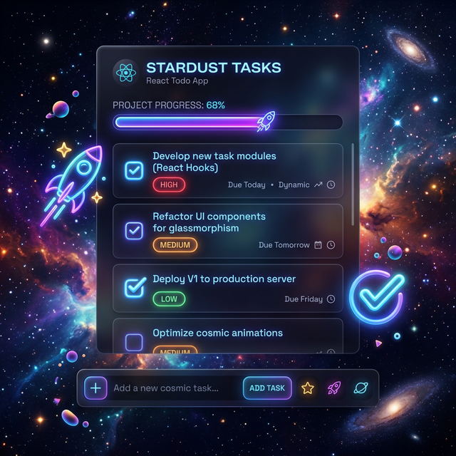

# 🌌 Cosmic Tasks: Mission Control for Your Productivity

**Cosmic Tasks** is a premium-quality, futuristic React Todo List application designed to elevate your productivity into the stratosphere. Built with **React 19** and **Vite**, it features a stunning glassmorphism UI, fluid micro-animations, and a robust set of features for modern mission management.

---

## 🎨 Visual Preview


*Behold the "Deep Space" interface in all its glassmorphic glory.*

---

## 🚀 Live Demo
Experience the cosmic interface here:  
👉 **[View Live Demo](https://AddyTheDeveloper.github.io/Todo-List/)**

---

## ✨ Stellar Features

### 💎 Ultra-Modern UI/UX
-   **Glassmorphism Engine:** Card layout with 24px blur, subtle border shimmers, and dynamic background blobs.
-   **3D Hover Effects:** Tasks tilt in 3D space as you hover, providing tactile visual feedback.
-   **Nebula Theme System:** Seamlessly toggle between "Deep Space" (Dark) and "Nebula White" (Light) modes with a single click.

### 📂 Mission Management
-   **Hierarchical Tasks:** Support for titles, detailed descriptions, and custom priorities.
-   **Priority Matrix:** Categorize tasks into **Low**, **Medium**, or **High** with semantic color coding.
-   **Due Date Orbit:** Set countdowns for your missions and track deadlines.
-   **Smart Alerts:** Automated "Exhausted / Overdue" detection with pulsing red warnings.

### ⏱️ Time & Progress Tracking
-   **Time in Orbit:** Integrated per-task timer to track exactly how long you've spent on a mission.
-   **Fleet Progress:** Interactive progress bar that visualizes your overall mission completion percentage.
-   **Status Filters:** Quickly pivot between "Active", "Completed", or "All" missions.

### ⚡ Power User Capabilities
-   **Keyboard Shortcuts:**
    -   `Enter` to launch a new task into orbit.
    -   `Escape` to abort task creation/editing.
    -   `Double-click` any task to instantly rename it.
-   **Toast Notifications:** Real-time feedback via custom-styled toast alerts for every action.
-   **Data Persistence:** Automatic `localStorage` syncing ensures your mission logs are safe across sessions.

---

## 🛠️ Tech Stack & Architecture

### **Core Frameworks**
-   **React 19:** Utilizing latest hooks (`useState`, `useEffect`, `useRef`) for optimal performance.
-   **Vite:** High-performance frontend tooling for instant HMR and lightning-fast builds.

### **Design System**
-   **Vanilla CSS + CSS Variables:** A robust token-based system drives the entire UI.
-   **Animations:** Pure CSS `@keyframes` (shimmering borders, floating blobs, slide-in transitions).
-   **Typography:** [Outfit](https://fonts.google.com/specimen/Outfit) — a modern, geometric sans-serif for high readability.

### **State & API**
-   **LocalStorage API:** Zero-backend data persistence for privacy and speed.
-   **SVGs:** Hand-crafted, semantic SVG icons for a lightweight footprint without external icon dependencies.

---

## 📁 Project structure

```text
Todo-List/
├── src/
│   ├── assets/             # Branding assets and mockup
│   ├── components/         # Modular UI Architecture
│   │   ├── Header.jsx      # Branding & Identity
│   │   ├── TodoInput.jsx   # Advanced task creation form
│   │   ├── TodoList.jsx    # Managed list container
│   │   ├── TodoItem.jsx    # Core logic: 3D hover, Timer, Meta-badges
│   │   ├── Filters.jsx     # Strategic mission filtering
│   │   ├── ProgressBar.jsx # Mission completion visualization
│   │   ├── ThemeToggle.jsx # Light/Dark mode orchestration
│   │   ├── Toast.jsx       # Global notification system
│   │   └── ...             # Decorative background elements
│   ├── App.jsx             # Root Logic & State Management
│   ├── index.css           # Global Design System & Token definitions
│   └── main.jsx            # React Entry Point
```

---

## 💻 Mission Launch (Local Setup)

1.  **Clone the Mission Logs:**
    ```bash
    git clone https://github.com/AddyTheDeveloper/Todo-List.git
    cd Todo-List
    ```

2.  **Fuel Up (Install Dependencies):**
    ```bash
    npm install
    ```

3.  **Ignition (Start Dev Server):**
    ```bash
    npm run dev
    ```

4.  **Launch:**
    Open `http://localhost:5173/` in your browser.

---

## 🤝 Contributing
Contributions are what make the open source community such an amazing place to learn, inspire, and create. Any contributions you make are **greatly appreciated**.

1. Fork the Project
2. Create your Feature Branch (`git checkout -b feature/AmazingFeature`)
3. Commit your Changes (`git commit -m 'Add some AmazingFeature'`)
4. Push to the Branch (`git commit -m 'Add some AmazingFeature'`)
5. Open a Pull Request

---

## 👤 Author
**Aditya Hans**  
*Full Stack Developer & UI Enthusiast*

-   **GitHub:** [@AddyTheDeveloper](https://github.com/AddyTheDeveloper)
-   **LinkedIn:** [adityahans17](https://linkedin.com/in/adityahans17)
-   **Email:** [adityahans.17@gmail.com](mailto:adityahans.17@gmail.com)

---

## 📄 License
This project is licensed under the MIT License - see the `LICENSE` file for details.
